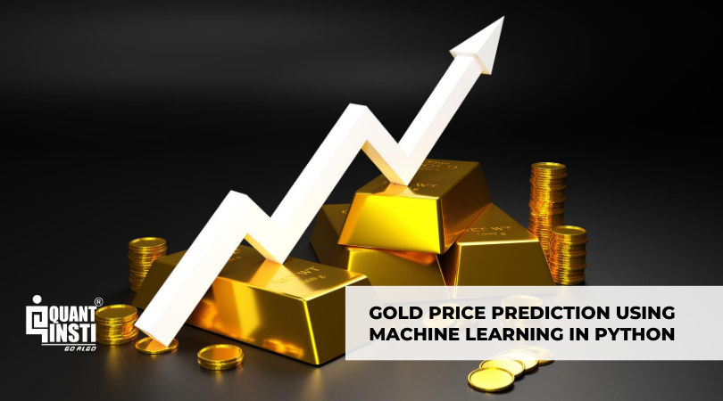

# 🏆 Gold Price Prediction Using Machine Learning

A machine learning project that predicts gold prices based on historical market data.  
This project uses Python and popular data science libraries to train, test, and evaluate predictive models.  



---

## 📌 Overview

Gold prices are influenced by multiple economic factors such as currency exchange rates, oil prices, and market trends.  
In this project, we build a **machine learning model** to analyze historical data and predict future gold prices.

---

## ✨ Features

- **Data Preprocessing** – Cleaning and transforming raw datasets  
- **Exploratory Data Analysis (EDA)** – Understanding patterns and correlations  
- **Model Training** – Using regression algorithms for prediction  
- **Model Evaluation** – Assessing accuracy with performance metrics  
- **Visualization** – Graphs and charts for insights  

---

## 🛠️ Tech Stack

- **Python 3**
- **Pandas** – Data manipulation
- **NumPy** – Numerical operations
- **Matplotlib & Seaborn** – Data visualization
- **Scikit-learn** – Machine learning models

---

## 🚀 Getting Started

### 1️⃣ Clone the repository
```bash
git clone https://github.com/Abahandy/Gold-price_prediction_with_machine_learning.git
cd Gold-price_prediction_with_machine_learning
